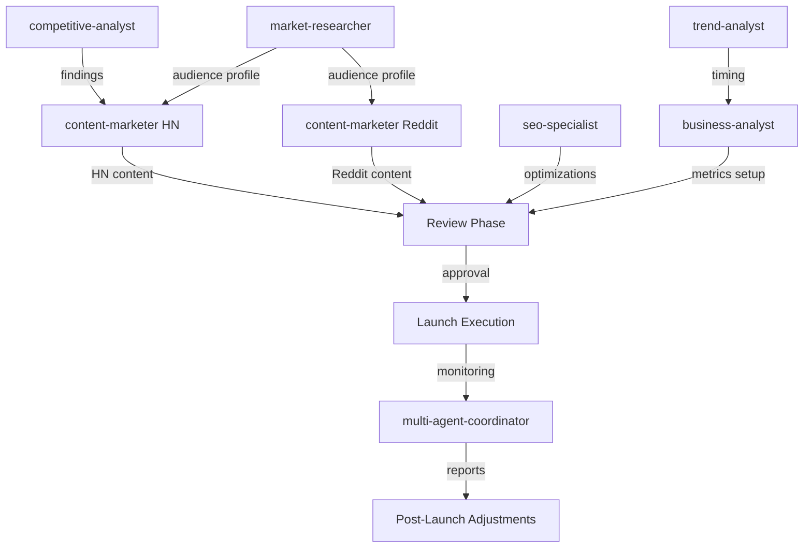

# HN + Reddit Launch: Multi-Agent Orchestration Plan

**Date**: 2026-02-11
**Objective**: Simultaneous launch on Hacker News (Show HN) and Reddit (r/LocalLLaMA)
**Target**: Maximize visibility, establish authority, generate backlinks, collect early feedback
**Constraint**: Same-day launch, 5-10 minute response time, team ready

---

## Executive Summary

This launch requires 7 specialized agents working in 3 parallel streams coordinated by `multi-agent-coordinator`. The workflow combines competitive research (understanding past launches), audience profiling (HN vs Reddit differences), timing optimization, content creation, SEO tuning, success metrics, and post-launch monitoring.

**Critical Path**: Research Phase (parallel) → Content Creation (parallel) → Review & Iterate → Launch → Monitor

---

## Phase 1: Research & Intelligence (PARALLEL - 45 minutes)

### Stream A: Competitive Intelligence
**Agent**: `competitive-analyst`
**Task**: Analyze 5-7 successful Show HN launches in the LLM/dev tools space (2024-2026)
**Output**: `/thoughts/research/2026-02-11_show-hn-competitive-analysis.md`

**Deliverables**:
- Title patterns that reach HN front page (word count, structure, keywords)
- Founder comment structures that drive engagement
- Response tactics to skeptical comments
- Traffic conversion rates (HN front page → signups)
- Timing analysis: day of week, hour posted, time to front page

**Example targets to analyze**:
- Perplexity launch
- Artificial Analysis launch
- Anthropic Claude announcements
- OpenRouter community posts
- LlamaIndex/LangChain Show HN

**Success criteria**:
- Identify 3-5 title patterns with >100 upvotes
- Document 5+ effective response strategies to criticism
- Extract timing recommendation (day + hour)

---

### Stream B: Audience Profiling
**Agent**: `market-researcher`
**Task**: Profile HN vs r/LocalLLaMA audience differences and content expectations
**Output**: `/thoughts/research/2026-02-11_hn-reddit-audience-profiling.md`

**Deliverables**:
- HN audience: demographics, technical level, what they upvote, what they downvote
- r/LocalLLaMA audience: self-hosting vs API users, open-source bias, affiliate sensitivity
- Content tone differences: HN = technical humility, Reddit = community discussion
- Key phrases that signal "marketing" vs "authentic dev sharing"
- Trust triggers for each platform (transparency, code, data, methodology)

**Research questions**:
1. What % of HN Show HN reach front page? What differentiates them?
2. What % of r/LocalLLaMA posts about pricing tools succeed vs get downvoted?
3. What's the sentiment toward "cost calculators" on each platform?
4. How do users respond to "open-sourced formula" messaging?

**Success criteria**:
- Clear tone guidelines for HN vs Reddit
- List of 10+ "red flag" phrases to avoid
- 5+ trust-building elements to emphasize

---

### Stream C: Timing & Trend Analysis
**Agent**: `trend-analyst`
**Task**: Identify optimal launch timing and current LLM pricing discussion trends
**Output**: `/thoughts/research/2026-02-11_launch-timing-trends.md`

**Deliverables**:
- Best day/hour for HN Show HN (based on 2024-2026 data)
- Best day/hour for r/LocalLLaMA posts
- Current trending topics on HN + Reddit (last 7 days) that we can reference
- Competitive launches in the next 2 weeks (avoid collision)
- LLM pricing news momentum (recent price drops, model launches)

**Timing recommendation format**:
```
Primary window: [Day] [Time CET] [Time EST]
Backup window: [Day] [Time CET] [Time EST]
Rationale: [Data-driven reasoning]
Collision risks: [Other launches to avoid]
```

**Success criteria**:
- Specific date + time recommendation with 3+ supporting data points
- Trend context that makes launch timely (e.g., "DeepSeek just dropped prices 40%")
- Collision analysis (no major competitor launches same day)

---

## Phase 2: Content Creation (PARALLEL - 60 minutes)

**Prerequisite**: Phase 1 outputs available

### Stream D: HN Title + Comment Optimization
**Agent**: `content-marketer`
**Input**: `/thoughts/research/2026-02-11_show-hn-competitive-analysis.md`
**Task**: Craft HN Show HN title + founder first comment
**Output**: `/thoughts/plans/2026-02-11_hn-content-final.md`

**Deliverables**:
1. **5 title variations** (A/B test internally, pick best)
   - Constraint: <80 chars, includes "Show HN:", emphasizes transparency
   - Example: `Show HN: We Open-Sourced the Math Behind LLM Cost Rankings (16 Models, Weekly Tracking)`

2. **Founder first comment** (250-400 words)
   - Structure: Problem → Solution → What's Inside → Transparency Hook → Invitation
   - Tone: Technical, humble, no marketing jargon
   - Include: Link to methodology blog post, public JSON link, GitHub (if applicable)

3. **Pre-written responses to 10 likely criticisms**:
   - "Weights are arbitrary"
   - "You don't measure quality"
   - "Looks like affiliate marketing"
   - "Why not use Artificial Analysis?"
   - "DeepSeek pricing is wrong" (example data dispute)
   - "This is just a calculator"
   - "No support for my model"
   - "How do you make money?"
   - "Open source the code"
   - "What about rate limits?"

**Success criteria**:
- Title scoring system: clarity (1-5), curiosity (1-5), credibility (1-5). Target: 4+ average
- First comment passes "no marketing smell test" (peer review)
- Responses are <150 words, non-defensive, educational

---

### Stream E: Reddit Post Optimization
**Agent**: `content-marketer`
**Input**: `/thoughts/research/2026-02-11_hn-reddit-audience-profiling.md`
**Task**: Craft r/LocalLLaMA post title + body + discussion prompts
**Output**: `/thoughts/plans/2026-02-11_reddit-content-final.md`

**Deliverables**:
1. **5 title variations**
   - Constraint: <300 chars, emphasizes transparency + community value
   - Example: `We open-sourced the math behind LLM cost rankings (full formula + public pricing JSON)`

2. **Post body** (400-600 words)
   - Structure: Context → Problem → Our Approach → What's Public → Community Question
   - Tone: Peer-to-peer, seeking feedback, acknowledging limitations
   - Must include: Methodology link, public JSON, question that invites debate (e.g., "Would you weight context higher than cost?")

3. **Pre-written responses to 10 likely r/LocalLLaMA criticisms**:
   - "No local model support" (LocalLLaMA loves self-hosting)
   - "Missing quantization cost data"
   - "API-only bias"
   - "What about vLLM / TGI?"
   - "OpenAI shill" (accusation)
   - "Why not compare quality?"
   - "No Ollama integration"
   - "Weights arbitrary"
   - "This is marketing"
   - "Data accuracy"

**Success criteria**:
- Title scores 4+ on authenticity scale (peer review)
- Body includes genuine question that sparks discussion
- Responses acknowledge self-hosting community values

---

### Stream F: SEO + Meta Optimization
**Agent**: `seo-specialist`
**Input**: Existing blog post at `/src/app/pages/blog/how-we-calculate-llm-tco.component.html`
**Task**: Optimize blog post meta tags, schema, and social sharing for launch traffic
**Output**: Code changes + `/thoughts/plans/2026-02-11_seo-launch-optimization.md`

**Deliverables**:
1. **Open Graph meta tags** (for social sharing)
   - og:title: Optimized for Twitter/Reddit previews
   - og:description: 155 chars, includes key benefit
   - og:image: Design hero image (or recommend dimensions)

2. **Schema.org markup** (if not present)
   - SoftwareApplication schema
   - FAQPage schema (if applicable)
   - Organization schema

3. **Title + meta description optimization**
   - Current: "We Open-Sourced the Math Behind LLM Cost Rankings"
   - Optimized for: Keyword "LLM cost calculator" + "pricing comparison"
   - Include target keywords without keyword stuffing

4. **Internal linking audit**
   - Link from homepage to blog post
   - Link from calculator tools to blog post
   - Anchor text diversity

5. **Technical checklist**:
   - Page speed: Target <2s load time
   - Mobile-friendly: Verify responsive design
   - Canonical URL: Set to production domain
   - Sitemap: Ensure blog post included

**Success criteria**:
- Lighthouse SEO score: 95+
- Social preview renders correctly on Twitter, Reddit, HN
- Page speed: <2s on 3G

---

## Phase 3: Business Intelligence (PARALLEL - 30 minutes)

### Stream G: Success Metrics & Post-Launch Plan
**Agent**: `business-analyst`
**Task**: Define KPIs, tracking setup, and post-launch monitoring plan
**Output**: `/thoughts/plans/2026-02-11_launch-metrics-monitoring.md`

**Deliverables**:
1. **Success metrics by tier**:
   - Tier 1 (Baseline): HN 30+ upvotes, Reddit 50+ upvotes, 1K visitors Day 1
   - Tier 2 (Success): HN front page, Reddit 100+ upvotes, 2.5K visitors Day 1, 200+ alert signups
   - Tier 3 (Home Run): HN top 10, Reddit 200+ upvotes, 5K+ visitors Day 1, 500+ alert signups

2. **Tracking setup**:
   - Google Analytics: Campaign URLs with UTM parameters
   - Plausible/Fathom (if using privacy-first analytics)
   - Supabase: Price alert subscription spike tracking
   - Conversion goals: Alert signup, tool usage, blog post time-on-page

3. **UTM parameter structure**:
   ```
   HN: ?utm_source=hackernews&utm_medium=show_hn&utm_campaign=feb2026_launch
   Reddit: ?utm_source=reddit&utm_medium=localllama&utm_campaign=feb2026_launch
   ```

4. **Post-launch monitoring plan** (first 48 hours):
   - Hour 1-2: Every 10 minutes (rapid response window)
   - Hour 3-6: Every 30 minutes
   - Hour 7-24: Every 2 hours
   - Hour 25-48: Every 4 hours
   - Notification triggers: New comment, upvote milestone, traffic spike

5. **Backup plan**:
   - If HN doesn't gain traction in first hour: Post to r/programming as backup
   - If Reddit downvoted: Analyze sentiment, adjust messaging for future attempts
   - If traffic spike crashes site: Vercel auto-scaling should handle, but monitor Edge Functions

6. **Follow-up content plan** (48 hours post-launch):
   - "We launched on HN and learned..." post-mortem (if successful)
   - Respond to every constructive feature request on GitHub issues
   - Email digest to alert subscribers: "Thanks for 500 signups, here's what's next"

**Success criteria**:
- All tracking verified before launch (test UTM clicks)
- Notification system functional (Slack webhook or email alerts)
- Team response protocol documented (who responds to what types of comments)

---

## Phase 4: Review & Iteration (SEQUENTIAL - 30 minutes)

**Coordinator**: `agent-organizer` (you, Claude Code)

**Task**: Review all outputs from Phase 1-3, identify conflicts or gaps, iterate

**Checklist**:
- [ ] Competitive analysis findings applied to content? (e.g., title structure)
- [ ] Audience profiling reflected in tone differences? (HN vs Reddit)
- [ ] Timing recommendation feasible given team availability?
- [ ] Content passes "no marketing smell test"? (peer review or founder review)
- [ ] SEO changes don't break existing functionality?
- [ ] Metrics tracking tested and verified?
- [ ] Pre-written responses cover 80%+ of likely criticism?

**Iteration protocol**:
1. Read all 7 outputs
2. Identify conflicts (e.g., tone mismatch, timing collision)
3. Send back to relevant agent for revision (specify exact change needed)
4. Re-review until all outputs aligned

**Output**: Approval to proceed to launch phase

---

## Phase 5: Launch Execution (SEQUENTIAL - 15 minutes)

**Owner**: Founder (Mattia) with agent support

**Launch sequence**:
1. **T-60 min**: Team on standby (Mattia + any co-founder/helper)
2. **T-30 min**: Final smoke test (blog post loads, UTM parameters work)
3. **T-15 min**: Copy-paste HN title + comment into notepad (ready to go)
4. **T-0**: Submit to HN Show HN
5. **T+2 min**: Post founder first comment on HN
6. **T+30 min**: Submit to Reddit r/LocalLLaMA
7. **T+5 min after any comment**: Respond (target: <10 min response time)

**Content-marketer role during launch**:
- Monitor HN + Reddit threads
- Draft rapid responses to new comment types (not in pre-written list)
- Escalate critical issues (e.g., data accuracy dispute) to founder
- Suggest tone adjustments if community sentiment shifts

**Trend-analyst role during launch**:
- Monitor upvote velocity (HN: 1 upvote/min = good signal)
- Alert if launch collides with breaking news (e.g., OpenAI announces GPT-5 same day)
- Suggest pivot if timing proves bad (e.g., launch gets buried)

---

## Phase 6: Post-Launch Monitoring (CONTINUOUS - 48 hours)

**Coordinator**: `multi-agent-coordinator`

**Active agents**:
- `business-analyst`: Track metrics, generate hourly reports
- `content-marketer`: Respond to comments, adjust messaging
- `trend-analyst`: Monitor momentum, identify inflection points

**Hourly report format** (first 6 hours):
```
Hour [X] Update:
- HN upvotes: [N] (velocity: [N]/hr)
- Reddit upvotes: [N] (velocity: [N]/hr)
- Traffic: [N] visitors (top sources: HN [X]%, Reddit [Y]%)
- Alert signups: [N] (conversion rate: [X]%)
- Comments: [N] (positive: [X]%, neutral: [Y]%, critical: [Z]%)
- Action needed: [Yes/No - describe]
```

**Escalation triggers**:
- Critical data dispute (escalate to founder + architect-reviewer)
- Traffic spike crashes site (escalate to devops-engineer)
- Negative sentiment >50% (escalate to content-marketer for tone adjustment)
- Upvote stall (escalate to trend-analyst for diagnosis)

**Success milestone notifications**:
- HN: 10, 30, 50, 100 upvotes
- Reddit: 25, 50, 100, 200 upvotes
- Traffic: 500, 1K, 2.5K, 5K visitors
- Signups: 100, 200, 500 alert subscribers

---

## Agent Dependency Graph



**Key observations**:
- Phase 1 (Research) is fully parallel: 3 agents can run simultaneously
- Phase 2 (Content) is partially parallel: HN + Reddit content can be written simultaneously, SEO optimization can happen in parallel
- Phase 3 (Business Intelligence) runs in parallel with Phase 2
- Phase 4 (Review) is sequential: requires all prior outputs
- Phase 5 (Launch) is sequential: time-sensitive, must execute in order
- Phase 6 (Monitoring) is continuous: multi-agent coordination required

---

## Risk Mitigation

### Risk 1: Timing collision with major news
**Likelihood**: Low (10%)
**Impact**: High (launch buried)
**Mitigation**: `trend-analyst` monitors breaking news 24 hours before launch. If collision detected, delay by 24 hours.

### Risk 2: Data accuracy dispute
**Likelihood**: Medium (30%)
**Impact**: Medium (credibility hit)
**Mitigation**: Pre-verify top 5 models' pricing against official docs. Include "last verified [date]" in responses. Commit to fix within 24 hours if error found.

### Risk 3: "Marketing smell" downvote cascade
**Likelihood**: Medium (25%)
**Impact**: High (launch fails)
**Mitigation**: `market-researcher` + `content-marketer` peer review all content. Remove all CTAs, no "subscribe" mentions in HN comment. Focus purely on technical transparency.

### Risk 4: Traffic spike crashes site
**Likelihood**: Low (5%)
**Impact**: Medium (bad first impression)
**Mitigation**: Pre-launch load test. Vercel auto-scaling should handle. Monitor Vercel dashboard. If needed, add Cloudflare caching.

### Risk 5: Team unavailable for rapid response
**Likelihood**: Low (5%)
**Impact**: High (comments go unanswered, momentum dies)
**Mitigation**: Schedule launch during team availability window. Pre-write 80%+ of responses. Set up mobile notifications.

---

## Success Criteria (Final)

### Minimum Viable Success (Tier 1)
- [ ] HN: 30+ upvotes, 15+ comments
- [ ] Reddit: 50+ upvotes, 20+ comments
- [ ] Traffic: 1,000+ unique visitors Day 1
- [ ] Alert signups: 100+
- [ ] No major credibility damage (data disputes resolved <24hr)

### Target Success (Tier 2)
- [ ] HN: Front page (typically 80+ upvotes), 30+ comments
- [ ] Reddit: 100+ upvotes, 40+ comments
- [ ] Traffic: 2,500+ unique visitors Day 1
- [ ] Alert signups: 200+
- [ ] 5+ quality backlinks generated (blogs, newsletters)
- [ ] 2+ constructive feature requests logged

### Exceptional Success (Tier 3)
- [ ] HN: Top 10 (typically 150+ upvotes), 50+ comments
- [ ] Reddit: 200+ upvotes, 60+ comments, cross-posted to r/MachineLearning
- [ ] Traffic: 5,000+ unique visitors Day 1
- [ ] Alert signups: 500+
- [ ] 10+ quality backlinks
- [ ] Media pickup (TechCrunch, The Verge mention)
- [ ] Inbound sponsor inquiry

---

## Agent Execution Order (Summary)

**PARALLEL (Phase 1 - 45 min)**:
1. `competitive-analyst`: Analyze Show HN launches
2. `market-researcher`: Profile HN vs Reddit audiences
3. `trend-analyst`: Identify optimal timing

**PARALLEL (Phase 2 - 60 min)**:
4. `content-marketer`: HN title + comment
5. `content-marketer`: Reddit post + responses
6. `seo-specialist`: Blog post optimization

**PARALLEL (Phase 3 - 30 min)**:
7. `business-analyst`: Metrics + monitoring plan

**SEQUENTIAL (Phase 4 - 30 min)**:
8. `agent-organizer` (Claude Code): Review all outputs, iterate if needed

**SEQUENTIAL (Phase 5 - 15 min)**:
9. Founder: Execute launch with content from Phase 2

**CONTINUOUS (Phase 6 - 48 hours)**:
10. `multi-agent-coordinator`: Monitor metrics + coordinate responses

---

## Next Steps (Immediate)

1. **Founder approval**: Review this plan, confirm timing window feasibility
2. **Agent dispatch**: Launch Phase 1 (parallel research) via `multi-agent-coordinator`
3. **Timeline**: If approved today (2026-02-11), earliest launch = 2026-02-13 (Wednesday) based on competitive timing data
4. **Resource check**: Confirm team availability for 2-hour rapid response window

---

**Plan Status**: READY FOR EXECUTION
**Owner**: Mattia (Founder) + Claude Code (Lead Orchestrator)
**Next Action**: Approve plan → Dispatch Phase 1 agents
